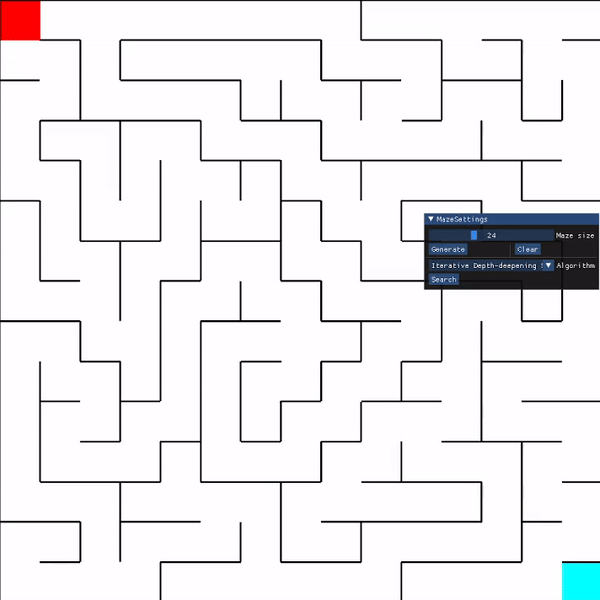
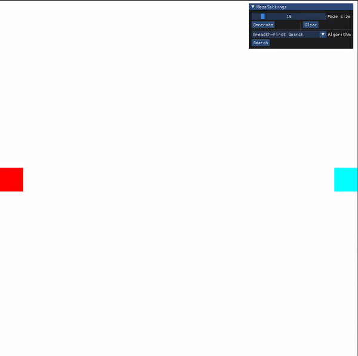

# Maze Search

This repository hosts a project that aims to illustrate various search algorithms used in Artificial
Intelligence, here applied in the context of solving Mazes.

## Prerequisites
1. Make sure you have [Python](https://www.python.org) installed.
2. **C/C++ Compiler**: Make sure you have a C/C++ compiler available on your system.
   - **Windows**: Install [Microsoft Visual C++](https://visualstudio.microsoft.com/visual-cpp-build-tools/).
   - **Linux**: Most distributions come with `gcc` pre-installed.
   - **macOS**: Xcode command line tools include a C/C++ compiler.

## Installation
1. **Clone the repository**:
   ```bash
   git clone https://github.com/mtbelkebir/MazeSearch.git
   cd MazeSearch
2. **Create a virtual environment (Recommended)**:
    ```bash
    python -m venv .venv
3. **Install the dependencies**:
    ```bash
   pip install -r requirements.txt

## Usage
Run the program using the following command:
```bash
python main.py
```

## Features

### Random Maze Generation
Easily create random, perfect mazes with customizable options for starting point, goal, and maze size, offering a unique challenge every time.



### Interactive Obstacle Drawing
Add a personal touch to the maze by drawing or erasing obstacles with your cursor. Press `W` to add obstacles and `X` to remove them.



### Customizable Start and Goal Points
Set your own starting point and goal within the maze by moving your cursor to the desired location and pressing `A` or `Z` respectively.
